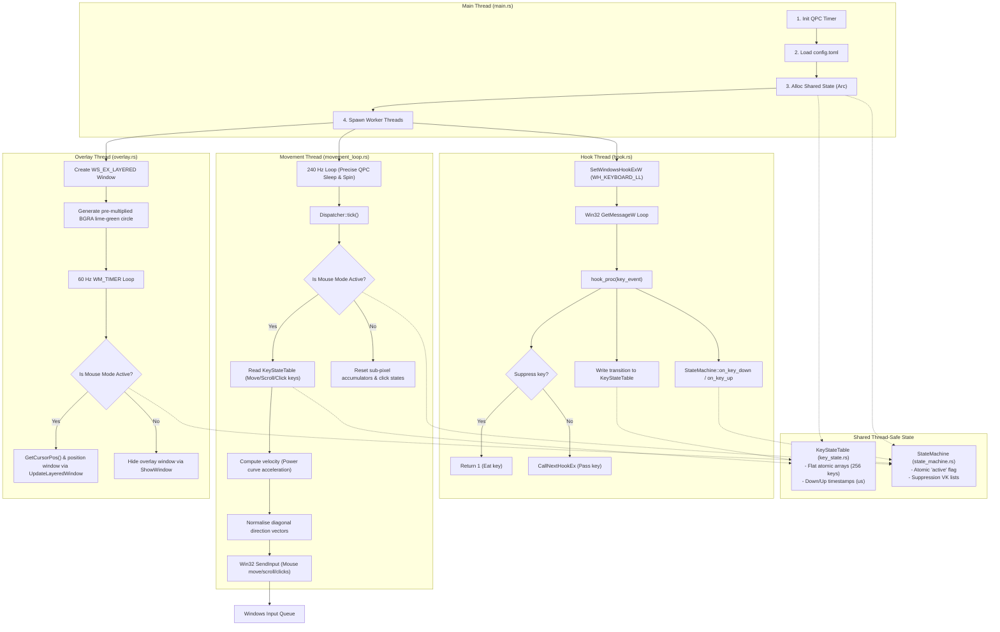
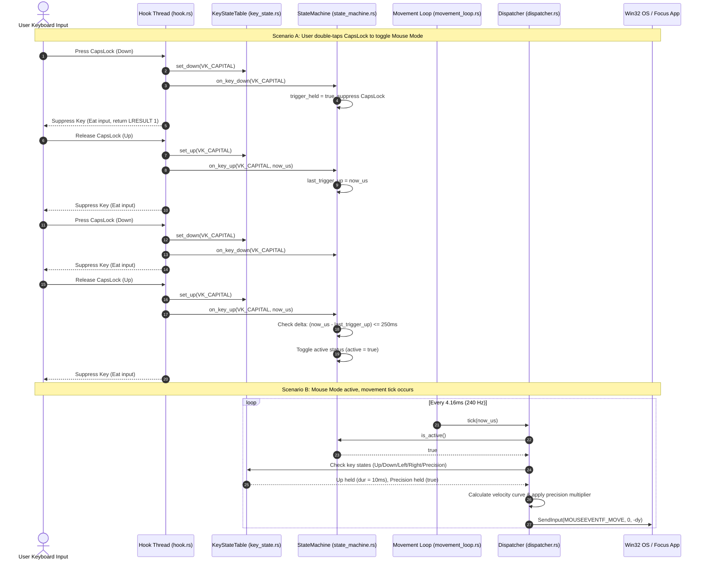

# mozkeys: System Architecture & Workflow

`mozkeys` is a low-latency, keyboard-driven mouse control utility for Windows. To achieve low latency (<5ms) and deterministic execution, it relies on a multi-threaded architecture with lock-free atomic shared memory.

---

## 1. Thread & Component Architecture

The following diagram illustrates how the threads cooperate using shared state (`KeyStateTable` and `StateMachine`) and Win32 system APIs.

---

## 2. Dynamic Input Event Sequence

The sequence diagram below visualizes:
1. **Scenario A**: Toggle sequence activating the mouse mode (CapsLock double-tap default configuration).
2. **Scenario B**: The periodic thread dispatch computing acceleration and sending cursor movements to the operating system.

---

## 3. Core Architectural Highlights

- **Lock-Free Concurrency**: Synchronisation between the critical **Hook Thread** (which must return in $< 1\,\text{ms}$) and the **Movement Thread** uses atomic fields (`AtomicBool`, `AtomicU64`) inside `KeyStateTable` and `StateMachine`. There are no mutexes or allocations in the critical hot path.
- **Power Curve Acceleration**: Movement ticks compute velocity dynamically:
  $$v(t) = \min(\text{base\_speed} + \text{acceleration} \times t^{1.5}, \text{max\_speed})$$
  This curve scales based on how long ($t$) the key has been held down.
- **Sub-Pixel Precision**: Floating-point displacements are accumulated inside `Dispatcher::accum_x` and `Dispatcher::accum_y`. Only when the accumulated displacement exceeds $\pm 1$ pixel is a Win32 `SendInput` event dispatched, ensuring smooth movement at ultra-low speeds.
- **DPI-Aware Layered Overlay**: The indicator overlay is drawn onto a custom 32-bit pre-multiplied BGRA memory DC bitmap, rendering a smooth anti-aliased lime green dot that updates dynamically at 60 Hz without stealing keyboard focus or capturing click events.
